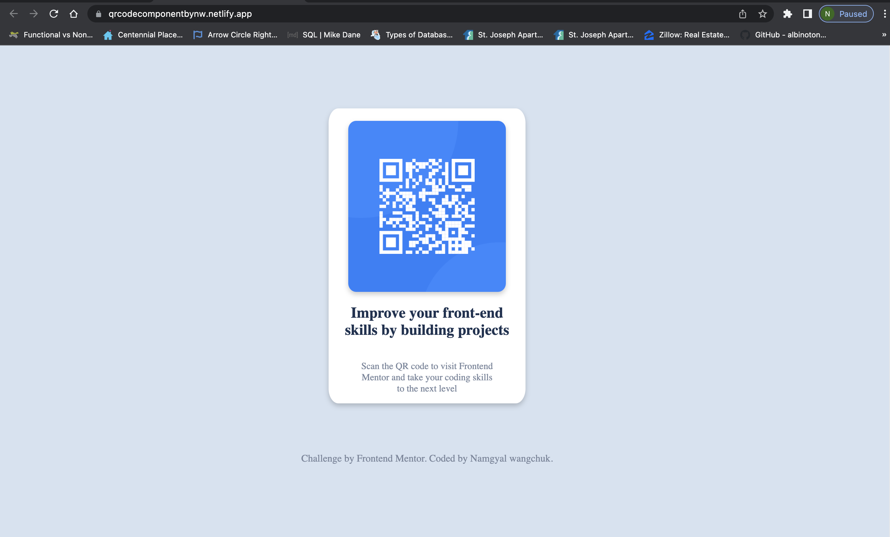

# Frontend Mentor - QR code component solution

This is a solution to the [QR code component challenge on Frontend Mentor](https://www.frontendmentor.io/challenges/qr-code-component-iux_sIO_H). Frontend Mentor challenges help you improve your coding skills by building realistic projects. 

### Screenshot

### Links

- Solution URL: (https://github.com/namgyalw/QR_component_challenges)
- Live Site URL: (https://qrcodecomponentbynw.netlify.app/)

## My process

### Built with

-HTML5 markup
- CSS custom properties
- Flexbox

### What I learned
I have learned about flex box 

## Author

- Website - [qrcodecomponent](https://qrcodecomponentbynw.netlify.app/)
- Frontend Mentor - [Namgyal wancghuk]

